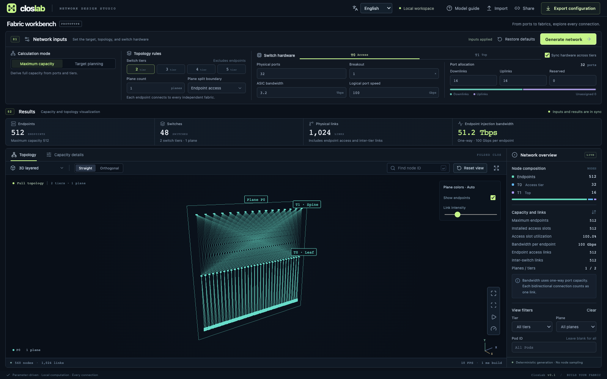

# ClosLab

English | [简体中文](README.zh-CN.md)

A parameter-driven workbench for Clos network capacity planning and full-topology visualization. Enter hardware specifications, switch tier counts, and plane rules to calculate endpoint capacity, device and link counts, and generate the actual connectivity graph.

Built with React, TypeScript, Vite, and Three.js / WebGL2. All computation runs locally in the browser, with no backend, runtime CDN, or telemetry dependencies.

## Getting started

Requires Node.js 22.12+ and npm.

~~~sh
npm ci
npm run dev
~~~

The default address is http://127.0.0.1:5173.

~~~sh
npm run build
npm run preview
~~~

Production files are written to **dist/** and can be deployed at the root of a static web server.

## Deploying to Cloudflare Pages

ClosLab builds into a static site, so Pages can serve the entire app from `dist/`. Computation and Web Workers run in the visitor's browser; no Pages Functions, database, or runtime secrets are required.

### Git integration (recommended)

1. Push this repository, including `package-lock.json`, to GitHub or GitLab.
2. In the Cloudflare dashboard, open **Workers & Pages → Create application → Pages → Connect to Git** (also labeled **Import an existing Git repository**).
3. Authorize access to the repository, select it, and begin setup. Use the following build settings:

| Setting | Value |
| --- | --- |
| Production branch | `main` (or your production branch) |
| Framework preset | `React (Vite)` |
| Root directory | Leave blank to use the repository root |
| Build command | `npm ci && npm run build` |
| Build output directory | `dist` |

The output directory follows Cloudflare's [React (Vite) build configuration](https://developers.cloudflare.com/pages/configuration/build-configuration/). The command explicitly installs the dependencies locked by npm before building.

4. Add these build environment variables for both production and preview deployments:

| Variable | Value |
| --- | --- |
| `NODE_VERSION` | `26.5.0` (the version used for the local build check) |
| `SKIP_DEPENDENCY_INSTALL` | `1` |

This repository contains both `package-lock.json` and `yarn.lock`. Skipping automatic dependency installation lets the explicit `npm ci` command select npm consistently. Set Node.js explicitly because Pages does not infer it from `package.json` → `engines` in its v3 build system. See Cloudflare's [build environment settings](https://developers.cloudflare.com/pages/configuration/build-image/).

5. Select **Save and Deploy**. Open the `https://<project-name>.pages.dev` address shown after the deployment succeeds.

Future pushes to the production branch trigger production deployments; other enabled branches receive preview deployments. See Cloudflare's [Git integration guide](https://developers.cloudflare.com/pages/get-started/git-integration/).

### Direct Upload from your computer

For a manual deployment, build locally:

~~~sh
npm ci
npm run build
~~~

In **Workers & Pages → Create application**, choose the Pages **Drag and drop your files** option, enter a project name, upload the generated `dist` folder, and select **Deploy site**. The uploaded site root should contain `index.html` and `assets/`.

A Direct Upload project cannot later be converted to Git integration; create a Git-integrated project from the start if you want automatic deployments. See Cloudflare's [Direct Upload guide](https://developers.cloudflare.com/pages/get-started/direct-upload/).

### Custom domain and deployment check

To use your own domain, open the Pages project and select **Custom domains → Set up a domain**, then follow the DNS instructions. Register the domain in Pages before adding DNS records. An apex domain such as `example.com` requires Cloudflare nameservers; a subdomain such as `closlab.example.com` can use a CNAME at an external DNS provider. See Cloudflare's [custom domain guide](https://developers.cloudflare.com/pages/configuration/custom-domains/).

After deployment, open the site in a browser with WebGL2 support, generate the default network, and confirm **512 endpoints, 48 switches, and 1,024 links**. Copy a share link and open it in a new tab to verify that the configuration is restored.

## Usage

The desktop interface fits into a single screen. The compact Network Inputs section at the top contains calculation modes, topology rules, and switch specifications. The Results section below brings together statistics, the topology, capacity breakdowns, and node details. The canvas fills the remaining height without requiring page scrolling. Editing an input marks the results as pending; they update only after you click Generate Network.

The interface defaults to English. Use the language selector in the header to switch between English and Simplified Chinese. Your choice is saved locally and does not change the network, view, or unapplied inputs.

1. Choose Maximum Capacity, or choose Target Planning and enter an endpoint count or total injection bandwidth.
2. Configure 2–5 switch tiers, the number of planes, and the plane split boundary. Endpoints do not count as a tier.
3. Configure hardware, breakout, downlink, uplink, and reserved ports in the T0, T1, and subsequent tabs. Sync Hardware to All Tiers copies only hardware specifications; port allocation remains independent for each tier.
4. Click Generate Network. Until the inputs are applied, statistics continue to show the previously generated network.
5. Switch between 3D Layered, Expanded Planes, 2D Layered, and Radial layouts, with straight or orthogonal links. Clicking the canvas selects the nearest visible node, so you do not need to hit a device precisely. The selected device and all directly connected links are highlighted; links use bright 3 px strokes while other links are dimmed. Node details appear on the right, and the canvas shows the direct link count. Click Clear Selection or press Esc to deselect. You can also search for IDs such as E-0 or T0-0 to locate a node.
6. Enter source and destination IDs, or click either field or its crosshair button and pick a node in the topology. The nearest visible node fills that field; press Esc or click the active crosshair again to cancel. Click View Shortest Path to display one path, or Show All Paths to highlight every equal-cost shortest path (ECMP). Results include the total path count, hops per path, and unique node and link counts. Identical endpoints produce one zero-hop path; endpoints are never used as transit nodes. Plane, tier, and Pod filters do not change capacity statistics. The bottom of the canvas shows the actual rendered counts.

In the 3D Layered and Expanded Planes layouts, each plane's switches lie in a separate geometric plane, with one row per switch tier. Rows extend with the node count, without wrapping or fitting into a fixed box. Expanded Planes uses wider spacing between planes. The 2D Layered layout places planes side by side in non-overlapping regions, aligns switch tier heights, and uses one row per tier in each region. Links within a plane do not cross another plane's region. Shared endpoints and switch tiers are placed separately below. When colored by plane, the entire link from a plane to a shared Leaf retains that plane's color, while shared nodes remain neutral. This applies to both straight and orthogonal links. The Radial layout organizes nodes by tier.

Plane colors and geometry are generated automatically. For 3–5 tier topologies without an explicit plane split, the shared Leaf tier is removed to identify planes from the actual connected components above it. Explicit multi-plane configurations use their configured plane groups. In 3D, each plane is a separate vertical surface with one row per tier. In three-tier networks, shared ToR switches form horizontal rows by Pod, with that Pod's Fabric Switches above them. Plane and Pod boundaries and labels are visual guides; they do not count as devices or physical links. At larger scales, each annotation type is limited to the first 64 groups, while all devices and links are still rendered. Automatically detected planes are also tiled horizontally in 2D. Spines and their downlinks are colored by plane; Fabric nodes above shared ToRs are colored by Pod. Shared Leaves and endpoints use neutral colors. Plane filters and node details use the same plane IDs. ToRs connect only to T1 switches in their own Pod, and T1 switches connect upward only to Spines in their own plane. Shared Spines can serve multiple Pods and remain visible when filtering by Pod. The default two-tier, single-plane network lies on one geometric plane: T0 and T1 each occupy one row, endpoints lie on the same plane, and all use the P0 color. The Radial layout retains concentric tiers. Existing `colorBy=tier` links automatically upgrade to plane coloring; no color mode selection is needed.

Parameters and views are saved locally. Generating a network or changing the view updates the address bar's query parameters with the currently applied configuration. Click Share at the top to copy a link that restores the network directly. URL parameters take precedence over locally saved settings, and unapplied inputs are excluded from share links. You can also exchange JSON files using Export Configuration and Import.

Large 2D graphs initially frame the tier heights, allowing long rows to extend beyond the viewport so that fitting every plane does not shrink the graph into a thin line. Use the scroll wheel to zoom and drag with the right mouse button to pan. Click Fit All in the bottom-right corner of the canvas to see the full extent, or Reset view above the graph to restore the initial readable scale.

Example share link (use your deployment's domain):

~~~text
/?ports=64&breakout=8&chipTbps=51.2&planes=8&layout=planes&colorBy=plane
~~~

Supported URL parameters include `tiers`, `planes`, `planeStart`, `mode` (capacity / endpoints / bandwidth), `endpoints`, and `bandwidth`. The `ports`, `breakout`, `chipTbps`, and `portGbps` parameters set shared hardware specifications; parameters such as `t0.down`, `t0.up`, `t0.reserved`, and `t1.ports` override individual tiers. The `layout`, `lines`, and `opacity` parameters control the view. Set `showEndpoints=false` to show only switches and inter-switch links while retaining full capacity statistics; endpoints are visible by default. The `colorBy` parameter remains for compatibility with older links, but coloring is always determined automatically. Generated share links include the complete configuration. Invalid parameters display an error and load the defaults.

The default configuration uses one plane, two tiers, 32×100G ports, a 3.2 Tbps ASIC, and an even downlink/uplink split, producing **512 endpoints, 48 switches, and 1,024 links**.

### 100,000-endpoint configuration

Use the standard parameter controls; no dedicated scenario mode is required:

| Parameter | Value |
| --- | --- |
| Calculation mode / target | Target Planning → 100,000 endpoints |
| Switch tiers | 2 |
| Planes / split boundary | 8 / Endpoint access |
| Physical ports / breakout | 64 / 8 |
| ASIC switching bandwidth | 51.2 Tbps |
| Logical port speed | 100 Gbps |
| T0 downlinks / uplinks | 256 / 256 |
| T1 downlinks / uplinks | 512 / 0 |

This produces **100,000 endpoints, 5,176 switches, 1,600,768 links, and 80 Pbps of total injection bandwidth**. Selecting Maximum Capacity produces 131,072 endpoints, 6,144 switches, and 2,097,152 links.

## Calculation model

Let d[i] be the downlink port count and u[i] the uplink port count at tier i, indexed from T0. The top tier has zero uplinks.

~~~text
Maximum endpoints = ∏ d[i]
G[0] = ceil(target endpoints / d[0])
G[i] = ceil(G[i-1] / d[i])       i > 0
W[0] = 1
W[i] = W[i-1] × u[i-1]          i > 0
Switches at tier i = G[i] × W[i] × R
Endpoint access links = target endpoints × R
Uplink connections from tier i = switches at tier i × u[i]
~~~

R equals the plane count when planes split at endpoint access, and 1 otherwise. Maximum Capacity uses the maximum endpoint count as the target. Counts use BigInt and are independent of rendering limits and floating-point integer precision.

The generator uses group to identify downstream groups and route to identify combinations of independent uplink choices. Each uplink connects to a deterministic node in the next tier. Target Planning fills groups sequentially, allows the last group to be partially populated, and preserves all uplink paths for every active group. This produces a feasible configuration under the specified wiring rules, without guaranteeing the global minimum device count. Small targets and configurations with many tiers can retain relatively large numbers of top-tier devices.

### Planes and hardware

- **Plane split at endpoint access:** Replicates the switching fabric for each plane. Endpoints are counted once and connect to every plane. Paths cannot use other endpoints as transit nodes.
- **Plane split above a switch tier:** Divides the uplink choice dimension at the boundary evenly among planes, requiring the uplink port count to be divisible by the plane count. Lower tiers are shared, and upper-tier connections stay within their plane. With fixed port specifications, changing the grouping does not add devices. Colors repeat beyond eight planes, but exact plane filtering remains available.
- ASIC bandwidth is the sum of all unidirectional port capacities: 32×100G = 3.2 Tbps, without an additional duplex multiplier.
- Effective ports = physical ports × breakout. Hardware changes update the logical port speed, which can also be overridden manually. Changing the physical port count or breakout redistributes ports evenly between downlinks and uplinks; all top-tier ports face downward.
- Each tier can use different switch specifications. In this initial version, logical port speeds are uniform within a switch and must match between adjacent tiers. Users supply breakout capabilities; the tool does not maintain a hardware model database.
- Total injection bandwidth is the sum of all endpoints' unidirectional access bandwidth. A multi-plane endpoint's bandwidth equals its logical link speed multiplied by the number of access planes.
- Each bidirectional point-to-point connection counts as one link. Independent breakout connections are counted separately; these counts do not represent optical transceivers, fiber strands, or breakout cable assemblies.
- The tool shows downlink/uplink ratios and aggregate inter-tier capacities. These metrics do not replace bisection bandwidth analysis or application throughput simulation.

## Full-topology rendering

Capacity calculation and graph generation are separate. The graph can expand to **250,000 total nodes and 5,000,000 physical links**. Above these limits, exact statistics remain available with an explicit notice; large graph arrays are not allocated, and the graph is never silently sampled.

- A Worker generates the edge table, CSR adjacency index, and deterministic layouts. Starting a new generation task terminates the previous Worker; layout and path requests use task IDs to isolate results.
- All-shortest-path analysis uses BFS with BigInt path counts, then traverses backward to collect participating nodes and links. It does not enumerate individual paths, and shared links are highlighted only once. Computation scales with the graph's nodes and links, avoiding stalls from combinatorial path growth.
- Endpoints use Points and switches use InstancedMesh. Straight links use indexed line segments with shared coordinates; orthogonal links are expanded in the vertex shader. Each physical link corresponds to one straight segment or three orthogonal segments.
- All nodes and links are submitted to the GPU; only explicit user filters change the submitted counts. Above 100,000 links, standard depth occlusion and color intensity reduce the overhead of transparency blending. Nodes render in a separate depth pass to remain visible and selectable. Smaller graphs use transparency blending.
- On a click, visible nodes are projected into screen space and the nearest node is selected by pixel distance. Filtered nodes and nodes outside the viewport are excluded; overlapping nodes favor the one in front. This runs only on clicks, without scanning every frame. Path and adjacency highlights come from the actual edge table. The canvas renders on demand and does not continuously consume GPU resources while idle.

## Validation

~~~sh
npm test                  # Calculations, graph structure, layouts, JSON
npm run build             # Type checking and production build
npm run test:e2e           # Local Chrome interactions and GPU rendering
npm run benchmark         # Production build and 30-second full-scale benchmark
~~~

Browser tests use an installed Google Chrome by default. You can also use Playwright Chromium:

~~~sh
npx playwright install chromium
PLAYWRIGHT_CHANNEL=chromium npm run test:e2e
~~~

Tests on macOS use ANGLE Metal. The benchmark runs at 1920×1080, DPR 1, with straight links and no filters, rotating continuously for 30 seconds and excluding the first second of frame-rate warmup. Background throttling, window occlusion, and other GPU workloads can affect results.

Reports are written to **artifacts/benchmark.json**, with screenshots in the same directory. They include the GPU, browser version, actual submitted counts, canvas dimensions, time to the first ready frame, median FPS, and P95 frame interval. The pass field checks readiness within 5 seconds and at least 30 FPS. The default command records results; to make the performance thresholds fail the test, use:

~~~sh
CLOSLAB_ENFORCE_PERF=1 npm run benchmark
~~~

See the [performance notes](docs/performance.md) for recorded measurements and hardware details, and [benchmark.json](docs/benchmark.json) for the raw data.

### Reference coverage

| Configuration | Endpoints | Switches | Physical links |
| --- | ---: | ---: | ---: |
| One plane, 64×800G, three tiers, even downlink/uplink split | 65,536 | 5,120 | 196,608 |
| Eight planes, 512×100G, two tiers, 100,000-endpoint target | 100,000 | 5,176 | 1,600,768 |
| Same configuration at maximum capacity | 131,072 | 6,144 | 2,097,152 |

These figures are derived from the connectivity rules in [Figure 1 of the MRC paper](https://cdn.openai.com/pdf/resilient-ai-supercomputer-networking-using-mrc-and-srv6.pdf) and this tool's population strategy. Tests generate the complete 131,072-endpoint graph and verify edge table counts, switch degrees, and paths across groups.

The [F16 / Minipack](https://engineering.fb.com/2019/03/14/data-center-engineering/f16-minipack/) example with equal Fabric and Spine counts uses standard heterogeneous parameters: T0 has 32×100G ports with 16 downlinks and 16 uplinks; T1/T2 have 128×100G ports and 12.8 Tbps ASICs; T1 uses 64 downlinks and 64 uplinks, while T2 uses 64 downlinks and 64 reserved ports. Sixteen planes split above T0. At maximum capacity, there are 64 Pods, each with 64 ToRs and 16 Fabric Switches. Each plane has 64 Fabric Switches and 64 Spines, for 1,024 devices in each of these two tiers and 4,096 ToRs in total. Endpoints are modeled as 16 equivalent 100G access ports per ToR, totaling 65,536. Tests verify equal row counts and aligned positions within each plane, and ensure that Fabric Switches connect only to Spines in the same plane.

This scale reproduces the diagram's structure with equal Fabric and Spine counts; it does not imply that the article reported these deployment totals. External connections from reserved Spine ports are not drawn. A partially populated Clos network does not generally have equal Fabric and Spine counts; the calculation engine continues to use the supplied ports and target scale.

Fabric Switches above shared ToRs are colored by Pod, so Fabric nodes in the same Pod share a color. Spines, plane boundaries, and inter-tier links remain colored by plane. Node and link colors are independent, and straight and orthogonal views follow the same rules.

Open this example with equal Fabric and Spine counts:

~~~text
/?tiers=3&ports=128&chipTbps=12.8&portGbps=100&t0.ports=32&t0.chipTbps=3.2&t0.down=16&t0.up=16&t2.down=64&t2.reserved=64&mode=capacity&planes=16&planeStart=1&layout=planes&showEndpoints=false
~~~

This initial version does not implement the MRC protocol, congestion control, failure timing simulation, or real network deployment.

## Code organization

~~~text
src/i18n/        Typed English/Chinese messages, language preference, React provider
src/model/       Pure TypeScript calculations, graph generation, layouts, JSON, unit tests
src/workers/     Computation Worker and client for cancellable tasks
src/render/      Batched rendering, nearest-node picking, performance measurement
src/components/  Parameter editing, canvas, node inspection
tests/           Browser interaction tests and production benchmarks
~~~

The main interfaces are TopologySpec, CapacitySummary, TopologyBuffers, and LayoutResult. Topology and layout are decoupled, so switching views does not change node IDs or link endpoints.
