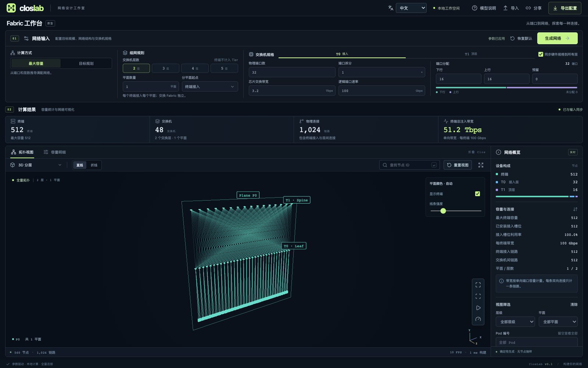

# ClosLab

[English](README.md) | 简体中文

参数驱动的 Clos 网络容量规划与全量可视化工作台。输入硬件规格、交换机层数与平面规则，计算终端容量、设备及链路数量，生成真实连接图。

React + TypeScript + Vite + Three.js / WebGL2。所有计算在浏览器本地完成，无后端、运行时 CDN 或遥测依赖。



## 启动

需要 Node.js 22.12+ 和 npm。已验证的 Node.js 版本固定在 `.node-version` 中，`package.json` 声明使用 npm，依赖以 `package-lock.json` 为准。

~~~sh
npm ci
npm run dev
~~~

默认地址为 http://127.0.0.1:5173。

~~~sh
npm run build
npm run preview
~~~

生产文件位于 **dist/**，可部署到静态服务器的根路径。

## 版本发布

发布命令使用 [bump2version](https://github.com/c4urself/bump2version) 提供的 `bumpversion` CLI。首次安装固定版本的发布工具：

```bash
uv tool install bump2version==1.0.1
```

也可以运行 `python3 -m venv .venv-release` 创建虚拟环境，用 `source .venv-release/bin/activate` 激活，再执行 `python -m pip install -r requirements-release.txt`。Python 仅用于发布，日常开发和构建不需要。

先提交代码，确保处于干净的 `main` 分支，再选择升级类型：

```bash
npm run release:patch -- --dry-run  # 预览下一个版本，不修改文件
npm run release:patch              # 修复版本
# npm run release:minor            # 新功能版本
# npm run release:major            # 不兼容变更
```

命令先执行测试和生产构建，再通过 `.bumpversion.cfg` 更新 `package.json`，同步 `package-lock.json` 中两处项目版本，生成 `Release vX.Y.Z` 提交和带注释的 `vX.Y.Z` 标签。锁文件中的依赖版本保持不变。请使用这些 npm 命令，而不是直接执行 `bumpversion`，确保锁文件、提交与标签一起更新。`npm run release:check` 检查版本一致性，每次构建前也会自动执行；`npm run test:release` 会在临时仓库中验证发布流程。

命令完成后会输出推送命令，例如 `git push --atomic origin main v0.1.1`，将版本提交与对应标签一起推送。创建本地版本不会自动推送或部署。现有 Cloudflare 流程仍由 `main` 推送触发部署，标签用于标识发布版本，不改变按分支部署的行为。

## 部署到 Cloudflare Pages

ClosLab 构建后是静态网站，Pages 直接托管 `dist/` 即可。计算和 Web Worker 均在访问者的浏览器中运行，无需 Pages Functions、数据库或运行时密钥。

### 通过 Git 自动部署（推荐）

1. 将仓库连同 `package-lock.json` 推送到 GitHub 或 GitLab。
2. 在 Cloudflare 控制台打开 **Workers & Pages → Create application → Pages → Connect to Git**（部分界面显示为 **Import an existing Git repository**）。
3. 授权并选择仓库，填写以下构建配置：

| 配置项 | 值 |
| --- | --- |
| Production branch | `main`，或实际生产分支 |
| Framework preset | `React (Vite)` |
| Root directory | 留空，使用仓库根目录 |
| Build command | `npm ci && npm run build` |
| Build output directory | `dist` |

输出目录符合 Cloudflare 的 [React (Vite) 构建配置](https://developers.cloudflare.com/pages/configuration/build-configuration/)。构建命令先按 npm 锁文件安装依赖，再生成静态文件。

4. 在 Production 和 Preview 环境中都配置以下构建环境变量：

| 变量 | 值 |
| --- | --- |
| `NODE_VERSION` | `26.5.0`，本地构建验证使用的版本 |
| `SKIP_DEPENDENCY_INSTALL` | `1` |

仓库统一使用 npm，只提交 `package-lock.json`。跳过自动依赖安装后，由构建命令中的 `npm ci` 按锁文件安装依赖。Pages 会读取 `.node-version` 中的 Node.js 版本；如果设置了 `NODE_VERSION`，请与该文件保持一致。Pages 的 v3 构建系统不会从 `package.json` 的 `engines` 自动选择 Node.js 版本。参见 [Cloudflare 构建环境说明](https://developers.cloudflare.com/pages/configuration/build-image/)。

5. 点击 **Save and Deploy**，部署成功后打开控制台给出的 `https://<project-name>.pages.dev` 地址。

后续推送到生产分支会自动部署；其他启用的分支会生成预览部署。参见 [Git 集成指南](https://developers.cloudflare.com/pages/get-started/git-integration/)。

如果部署日志出现 Yarn 和 `YN0028`，说明构建仍在使用 Yarn。请确认部署的提交中已移除 `yarn.lock`，在当前部署环境（Production 或 Preview）设置 `SKIP_DEPENDENCY_INSTALL=1`，并将构建命令设为 `npm ci && npm run build`。保存设置后重新部署更新后的提交，安装日志应显示 npm。`YN0028` 表示 Yarn 安装需要修改锁文件，但当前启用了不可变安装；参见 [Yarn 错误说明](https://yarnpkg.com/advanced/error-codes#yn0028---frozen_lockfile_exception)。

### 通过 GitHub Actions 自动部署

仓库附带的 [Deploy Cloudflare Pages workflow](.github/workflows/cloudflare-pages.yml) 会在每次推送到 `main` 时自动请求 Pages 构建，包括合并 PR 后的推送，同时保留在 `main` 上手动重试的入口。将 hook URL 保存在 GitHub Actions Secret 中，不要提交到 workflow、`.env` 文件或应用源码。

1. 在 Cloudflare Pages 项目中打开 **Settings → Builds → Add deploy hook**，填写名称并将构建分支设为 `main`，复制生成的 URL。
2. 在 GitHub 仓库打开 **Settings → Secrets and variables → Actions → New repository secret**。名称填 `CLOUDFLARE_DEPLOY_HOOK`，值只填完整 URL，不包含 `curl` 命令。
3. 将 workflow 推送到 `main`，本次及后续推送到 `main` 都会自动请求部署。需要手动重试时，打开 **Actions → Deploy Cloudflare Pages → Run workflow** 并选择 `main`。
4. 如果 Pages 的 Git 集成也启用了生产分支自动部署，请在 Pages 项目的分支部署设置中关闭 **Enable automatic production branch deployments**，避免重复构建。保留 GitHub 仓库连接，让 hook 能拉取源码。参见 [Cloudflare 分支部署控制](https://developers.cloudflare.com/pages/configuration/branch-build-controls/)。

workflow 通过环境变量读取 `${{ secrets.CLOUDFLARE_DEPLOY_HOOK }}`。运行成功只表示部署请求已接受，实际构建结果请在 Cloudflare 查看。构建分支由 Cloudflare 中的 hook 配置决定，请保持为 `main`。在其他分支手动运行时会跳过部署任务。上述 npm 构建配置仍需保留。

提交或更新 PR 不会触发此部署 workflow，部署任务也不会检出或执行应用代码。请保护 `main`，合并前审核 `.github/workflows/` 的改动。拥有仓库写权限的协作者仍能通过 workflow 访问 Repository Secrets；分支过滤不能阻止拥有写权限的人或已合并的恶意 workflow 泄露密钥。参见 [GitHub workflow 安全说明](https://docs.github.com/en/actions/reference/security/secure-use)。

hook URL 本身就是部署凭据，无需额外 API Token。如果 URL 被公开或怀疑有人未经授权使用，请删除原 hook、创建新 hook，并更新 Secret。参见 [GitHub Actions Secrets](https://docs.github.com/en/actions/how-tos/write-workflows/choose-what-workflows-do/use-secrets) 和 [Cloudflare Deploy Hooks](https://developers.cloudflare.com/pages/configuration/deploy-hooks/)。

### 从本机直接上传

在本机先执行：

~~~sh
npm ci
npm run build
~~~

打开 **Workers & Pages → Create application**，选择 Pages 的 **Drag and drop your files**，输入项目名并上传生成的 `dist` 文件夹，点击 **Deploy site**。上传后的站点根目录应包含 `index.html` 和 `assets/`。

Direct Upload 项目无法直接转换为 Git 集成项目；如需后续自动部署，建议一开始就使用 Git 集成。参见 [Direct Upload 指南](https://developers.cloudflare.com/pages/get-started/direct-upload/)。

### 自定义域名与部署检查

在 Pages 项目中打开 **Custom domains → Set up a domain**，按提示配置 DNS。先在 Pages 中登记域名，再添加 DNS 记录。根域名（例如 `example.com`）需要使用 Cloudflare 的域名服务器；子域名（例如 `closlab.example.com`）可在外部 DNS 服务商处设置 CNAME。参见 [自定义域名指南](https://developers.cloudflare.com/pages/configuration/custom-domains/)。

部署后用支持 WebGL2 的浏览器打开站点，生成默认网络并确认 **512 个终端、48 台交换机、1,024 条链路**。复制分享链接，在新标签页打开，确认配置可以恢复。

## 使用

界面默认使用英文，可通过顶部语言选择器切换 English / 中文。语言偏好会在浏览器本地保存；切换语言保留当前网络、视图和未应用的输入。下文使用中文控件名称。

桌面主界面按一屏布局：上方紧凑的「网络输入」集中配置计算方式、组网规则与交换机规格；下方「计算结果」统一展示统计、拓扑、容量明细和节点详情，画布占用剩余高度，不需要滚动页面。修改输入后，结果区提示待应用，点击「生成网络」才更新结果。

1. 选择「最大容量」，或选择「目标规划」并输入终端数 / 总注入带宽。
2. 配置 2–5 个交换层、平面数量与分平面起点。终端不计入 tier。
3. 在 T0、T1 等标签中配置硬件、Breakout、下行、上行和预留端口。「同步硬件规格到所有层」只同步硬件，端口分配逐层独立。
4. 点击「生成网络」。参数尚未应用时，统计仍显示上一份已生成的网络。
5. 切换 3D 分层、平面展开、2D 分层、径向布局，连线统一使用直线。点击画布会选择离点击位置最近的可见节点，无需精确点中设备；选中设备及全部直连链路高亮，连线使用 3px 亮色粗线，其余连线变暗。右侧显示节点详情，画布显示直连链路数。点击「清除选择」或按 Esc 取消。也可输入 E-0、T0-0 等 ID 搜索定位。
6. 输入源 / 目的节点 ID，或点击对应输入框、旁边的准星按钮，再点选拓扑中的节点。系统会将最近的可见节点填入该字段；按 Esc 或再次点击已激活的准星可取消点选。点击「查看最短路径」显示一条路径，或点击「显示所有路径」高亮全部等长最短路径（ECMP），显示路径总数、每条跳数及去重后的节点 / 链路数。相同端点是一条 0 跳路径；终端不作为中转节点。平面、层级和 Pod 筛选不改变容量统计，画布底部显示实际绘制数量。

多平面网络在「3D 分层」和「平面展开」中，每个平面的交换机都位于一块独立的几何平面内，每个交换层只排一行，长度随节点数延伸，不折行、不限制在固定盒子内。「平面展开」使用更大的平面间距。「2D 分层」将各平面从左到右平铺到互不重叠的区域，交换层高度对齐，各区域内每层只排一行；平面内部链路不会穿过其他平面的区域。共享终端及共享交换层单独放在下方。按平面着色时，平面到共享 Leaf 的整条链路保持该平面的颜色，共享节点本身保持中性色。径向布局按层级组织。

平面颜色与几何布局均自动生成。未显式分平面的 3–5 tier 拓扑，会移除共享 Leaf 层后按上层实际连通分量识别平面；显式多平面配置使用配置的平面分组。3D 中每个平面是独立的竖直面、每层一行；三层网络的共享 ToR 按 Pod 横排，同一 Pod 的 Fabric Switch 位于这些横排上方。平面及 Pod 边框、Plane / Pod 编号都是辅助标注，不计入设备和物理链路；规模较大时每类最多标注前 64 个，全部设备和链路仍照常渲染。2D 中自动平面同样横向平铺。Pod 布局下，下方每个 Pod 的 ToR、Fabric、ToR–Fabric 连线、边框及标签统一使用 Pod 颜色；上方 Fabric–Spine 连线、Spine 和平面边框保持网络平面颜色，终端保持中性色。平面筛选与节点详情使用同一组平面编号。ToR 只连接本 Pod 的 T1；T1 向上只进入所属平面的 Spine。共享 Spine 可以服务多个 Pod，Pod 筛选会保留它们。默认两层单平面网络整体放在同一个几何面内：T0、T1 各占一行，终端也位于该面，统一使用 P0 颜色。径向布局仍按同心层组织。已有 `colorBy=tier` 链接会自动升级为平面着色，无需选择颜色模式。

参数和视图会本地保存；每次生成网络或修改视图，地址栏 query params 会同步当前已应用配置。「分享」弹窗中可以复制网络链接，也可以一键复制用于博客的 **iframe**，代码旁边提供实时预览。两者都使用已应用的配置和当前视图，不包含未应用的输入。iframe 只读展示拓扑、设备与链路数量、带宽和各层硬件参数；支持旋转、缩放、点选设备及重置视图，不提供参数编辑。嵌入页面（`embed=1&lang=zh-CN` 或 `lang=en`）不会读取或覆盖本地保存的项目。供博客读者访问时，请在已公开部署的站点上复制 iframe。链接参数优先于浏览器本地保存的配置。已有的 JSON 配置文件可通过「导入」加载。

分享弹窗支持设置 iframe 宽度（像素或百分比）和高度（像素），代码与实时预览同步更新。预览过大时按比例缩小显示，内部仍使用指定的视口尺寸。嵌入页顶部的 ClosLab 链接会在新标签页打开主页。

2D 大图默认按层间高度取景，长行可以延伸到视口外，避免为塞下所有平面而缩成细线。滚轮缩放、右键拖动平移；点击画布右下角「查看全图」可看到完整范围，图区域顶部的「Reset view」恢复初始可读比例。

分享链接示例（将域名替换为部署地址）：

~~~text
/?ports=64&breakout=8&chipTbps=51.2&planes=8&layout=planes&colorBy=plane
~~~

URL 支持 `tiers`、`planes`、`planeStart`、`mode`（capacity / endpoints / bandwidth）、`endpoints`、`bandwidth`；`ports`、`breakout`、`chipTbps`、`portGbps` 设置公共硬件规格，`t0.down`、`t0.up`、`t0.reserved` 及 `t1.ports` 等可逐层覆盖。`layout`、`opacity` 控制视图，旧链接中的 `lines` 参数会被忽略；`showEndpoints=false` 只显示交换机和交换机间链路，保留完整容量统计，默认显示终端。`colorBy` 保留作为旧链接兼容参数，着色始终自动确定。自动生成的分享链接包含完整配置；非法参数会提示错误并载入默认配置。

默认配置：单平面、2 tier、32×100G、3.2Tbps ASIC、上下行均分，得到 **512 个终端、48 台交换机、1,024 条链路**。

### 十万终端配置

使用普通参数控件即可生成，无专用案例模式：

| 参数 | 值 |
| --- | --- |
| 计算方式 / 目标 | 目标规划 → 100,000 个终端 |
| 交换层数 | 2 |
| 平面数量 / 起点 | 8 / 终端接入 |
| 物理端口 / Breakout | 64 / 8 |
| 芯片交换带宽 | 51.2 Tbps |
| 逻辑端口速率 | 100 Gbps |
| T0 下行 / 上行 | 256 / 256 |
| T1 下行 / 上行 | 512 / 0 |

结果：**100,000 个终端、5,176 台交换机、1,600,768 条链路、80 Pbps 总注入带宽**。选择「最大容量」后得到 131,072 个终端、6,144 台交换机和 2,097,152 条链路。

## 计算模型

第 i 层下行端口记为 d[i]，上行端口记为 u[i]，顶层上行为 0；索引从 T0 开始。

~~~text
最大终端数 = ∏ d[i]
G[0] = ceil(目标终端数 / d[0])
G[i] = ceil(G[i-1] / d[i])       i > 0
W[0] = 1
W[i] = W[i-1] × u[i-1]          i > 0
第 i 层交换机数 = G[i] × W[i] × R
终端接入链路数 = 目标终端数 × R
第 i 层上行链路数 = 第 i 层交换机数 × u[i]
~~~

R 在终端分平面时等于平面数量，其余为 1。满配时使用最大终端数作为目标。计数使用 BigInt，不受渲染预算或浮点整数精度影响。

生成器用 group 标识下游分组，route 标识独立上行选择组合，每条上行连接到下一层的确定节点。目标规划依次填充，末组允许未满配，启用组保留全部上行路径。这是指定布线规则下的可行配置，不保证全局最少设备数；小目标和多 tier 组合可能保留较多顶层设备。

### 平面与硬件

- **终端接入分平面**：复制交换 Fabric，终端只计一次，并连接各平面。路径不能把其他终端当作中转节点。
- **交换层上方分平面**：均分边界上行选择维度，要求上行端口数可被平面数整除。低层共享，高层连接不跨平面。固定端口规格时改变分组不会增加设备。超过 8 个平面时颜色循环，仍可精确筛选。
- 芯片带宽采用所有单向端口容量之和，32×100G = 3.2Tbps，不再次乘以双工系数。
- 有效端口数 = 物理端口数 × Breakout。修改硬件会联动逻辑速率，速率也可手动覆盖。修改端口数 / Breakout 会重新均分上下行端口，顶层全部向下。
- 每层可用不同交换机规格；首版同台设备的逻辑端口速率相同，相邻层速率必须匹配。Breakout 能力由用户提供，工具不维护设备型号数据库。
- 总注入带宽是全部终端的单向接入带宽之和。多平面终端带宽 = 逻辑链路速率 × 接入平面数。
- 每条双向点到点连接只计一条链路。Breakout 的独立连接分别计数，不等同于光模块、光纤芯数或扇出线缆组件数量。
- 显示下行 / 上行比、层间容量之和；这些指标不替代二分带宽或应用吞吐仿真。

## 全量渲染

容量统计和图生成分离。最多展开 **250,000 个总节点、5,000,000 条物理链路**。超出预算时保留精确统计并明确提示，不分配大图数组，不静默抽样。

- Worker 生成边表、CSR 邻接索引和确定性布局。新生成任务终止旧 Worker，布局和路径请求用任务编号隔离结果。
- 所有最短路径采用 BFS 与 BigInt 计数，再反向收集最短路径经过的节点和链路；不逐条展开路径，共享链路仅高亮一次。计算量随节点、链路规模增长，避免路径组合数量膨胀导致卡顿。
- 终端使用 Points，交换机使用 InstancedMesh；连线使用共享坐标的索引线段，一条物理链路对应一条直线。
- 所有节点、链路提交到 GPU，仅用户主动筛选改变提交数量。超过 100,000 条链路时采用标准深度遮挡与颜色强度，降低透明叠加开销；节点在独立深度阶段绘制，保持可见和可选。小图采用透明叠加。
- 点击时投影当前可见节点，按屏幕像素距离选择最近节点，过滤被筛选或位于视口外的节点；重叠时优先选靠前的节点。仅点击时计算，不逐帧扫描。路径和邻接高亮来自实际边表。画布按需渲染，静止时不持续消耗 GPU。

## 验证

~~~sh
npm test                  # 计算、图结构、布局、JSON
npm run build             # 类型检查与生产构建
npm run test:e2e           # 本机 Chrome 交互与 GPU 绘制
npm run benchmark         # 生产构建、30 秒完整规模性能测试
~~~

浏览器测试默认使用已安装的 Google Chrome，也可选择 Playwright Chromium：

~~~sh
npx playwright install chromium
PLAYWRIGHT_CHANNEL=chromium npm run test:e2e
~~~

macOS 测试使用 ANGLE Metal。性能基准为 1920×1080、DPR 1、直线、无筛选，连续旋转 30 秒，排除首秒帧率预热。后台节流、窗口遮挡和其他 GPU 负载会影响结果。

报告写入 **artifacts/benchmark.json**，截图在同目录，包含 GPU、浏览器版本、实际提交数量、画布尺寸、首帧就绪耗时、中位 FPS 和 P95 帧间隔。pass 字段检查 ≤5 秒就绪和 ≥30 FPS；普通命令采集结果，将性能门槛作为测试失败条件时使用：

~~~sh
CLOSLAB_ENFORCE_PERF=1 npm run benchmark
~~~

本次实测及硬件环境见 [性能记录](docs/performance.md)，原始数据见 [benchmark.json](docs/benchmark.json)。

### 参考覆盖

| 参数模型 | 终端 | 交换机 | 物理链路 |
| --- | ---: | ---: | ---: |
| 单平面、64×800G、3 tier、上下行均分 | 65,536 | 5,120 | 196,608 |
| 8 平面、512×100G、2 tier、目标十万 | 100,000 | 5,176 | 1,600,768 |
| 同上满配 | 131,072 | 6,144 | 2,097,152 |

数字由 [MRC 论文图 1](https://cdn.openai.com/pdf/resilient-ai-supercomputer-networking-using-mrc-and-srv6.pdf) 的连接规则及本工具填充策略推导。测试完整生成 131,072 终端的图，核对边表数量、交换机度数及跨组路径。

[F16 / Minipack](https://engineering.fb.com/2019/03/14/data-center-engineering/f16-minipack/) 的等规模图示示例使用普通异构参数：T0 为 32×100G、上下行各 16；T1/T2 为 128×100G、12.8Tbps；T1 上下行各 64，T2 下行 64、预留 64；T0 上方划分 16 平面。满配为 64 个 Pod，每个 Pod 有 64 台 ToR 和 16 台 Fabric Switch；每个平面有 64 台 Fabric 和 64 台 Spine，两层各 1,024 台，ToR 共 4,096 台。终端按每 ToR 16 个 100G 等效接入口建模，共 65,536 个。测试核对每个平面的两行数量相等、位置对齐、Fabric 只连接该平面的 Spine。

该规模用于复现示意图中 Fabric / Spine 等规模的结构，不代表文章公布了这些部署总量。Spine 预留端口未绘制外部连接。一般的部分填充 Clos 不保证 Fabric 与 Spine 数量相等，计算引擎仍按输入端口和目标规模计算。

下方每个 Pod 的 ToR、Fabric、ToR–Fabric 连线、边框及标签统一使用 Pod 颜色；上方 Fabric–Spine 连线、Spine 和平面边框使用网络平面颜色。

可直接打开的等规模示例：

~~~text
/?tiers=3&ports=128&chipTbps=12.8&portGbps=100&t0.ports=32&t0.chipTbps=3.2&t0.down=16&t0.up=16&t2.down=64&t2.reserved=64&mode=capacity&planes=16&planeStart=1&layout=planes&showEndpoints=false
~~~

首版不实现 MRC 协议、拥塞控制、故障时序仿真或真实网络部署。

## 代码组织

~~~text
src/i18n/        中英文文案、语言偏好与 React 上下文
src/model/       纯 TypeScript 计算、图生成、布局、JSON、单元测试
src/workers/     计算 Worker 和可取消任务客户端
src/render/      批量渲染、最近节点选择、性能测量
src/components/  参数编辑、画布、节点检查
tests/           浏览器交互测试、生产性能基准
~~~

主要接口：TopologySpec、CapacitySummary、TopologyBuffers、LayoutResult。拓扑和布局解耦，切换视图不改变节点 ID 或链路端点。
