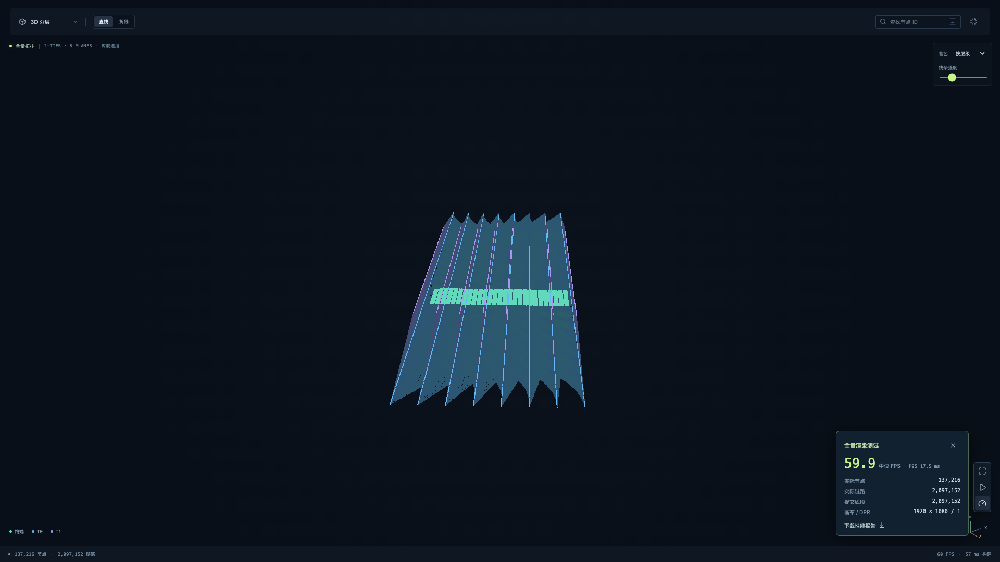

# 全量渲染验收

测试日期：2026-09-25。以实际生产构建运行本机 Chrome，不使用节点抽样、连线聚合或降分辨率。

| 项目 | 实测 |
| --- | --- |
| 硬件 | Apple M4 Pro / 24 GiB |
| 浏览器 | Headless Chrome 153.0.8010.53 |
| GPU | ANGLE Metal / Apple M4 Pro |
| 画布 | 1920 × 1080 / DPR 1 |
| 终端 | 131,072 |
| 交换机 | 6,144 |
| 提交总节点 | 137,216 |
| 提交链路 / 线段 | 2,097,152 / 2,097,152 |
| 绘制调用 | 3 |
| 导入到可交互 | 794 ms |
| 连续旋转 | 30 秒 |
| 中位帧率 | 59.9 FPS |
| P95 帧间隔 | 17.5 ms |
| 门槛 | ≤5 秒就绪且 ≥30 FPS；通过 |

基准使用 3D 分层与直线，镜头按实际包围球取景，旋转时整张图保持在视野内。所有链路都提交；大图使用标准深度遮挡减少重复像素处理，节点在独立深度阶段绘制。没有筛选、抽样或聚合。

首帧时间从测试开始导入参数 JSON 计至页面报告全量网络可交互，包含导入、Worker 计算、GPU 上传与就绪状态轮询。帧率统计来自实际 requestAnimationFrame 间隔，排除首秒预热，取余下帧间隔的中位数和第 95 百分位。

单次结果不是所有设备和配置下的帧率保证；完整条件和参数保存于 [原始报告](benchmark.json)。运行 npm run benchmark 可重测；CLOSLAB_ENFORCE_PERF=1 会将性能目标作为测试断言。

